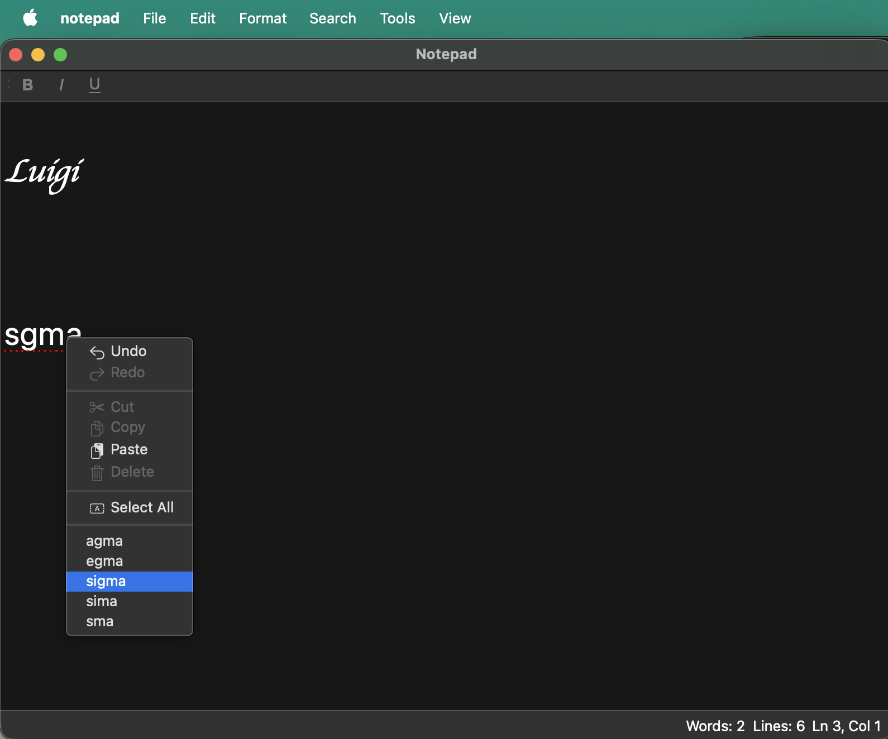

# Notepad — Implementation Notes

## Developer Tools

* [CLion](https://www.jetbrains.com/clion/download)
* [Git SCM](https://git-scm.com/downloads)

## Libraries

* [Qt 6](https://www.qt.io)

---

## Features

### 1. Exception Handling

Integrated the exception hierarchy from Practice #8 into the application:

* Created `notepad_exception.h` with `notepad_exception`, `file_not_found_exception`, `file_read_exception`, and `file_write_exception`.
* Wrapped `open_file()` and `save_file()` in `try / catch` blocks; errors are displayed with `QMessageBox::critical` using the title `Error`.

### 2. Spell Checker

Added a spell checker using the provided `data/words.txt` word list (one word per line). The list is `words_alpha.txt` from [dwyl/english-words](https://github.com/dwyl/english-words), released into the public domain under [The Unlicense](https://github.com/dwyl/english-words/blob/master/LICENSE.md) (370105 lowercase a-z entries).

* Loaded the word list from `data/words.txt` at startup into a `std::set<std::string>`.
* Real-time inline highlighting: misspelled words are underlined in red as you type, using a `QSyntaxHighlighter` subclass (`spell_checker_highlighter`) with `QTextCharFormat::SpellCheckUnderline`.
* Right-click context menu: right-clicking a misspelled word shows a `QMenu` with up to 5 spelling suggestions generated via edit distance; clicking a suggestion replaces the word in the editor.
* Added a `Tools` > `Check Spelling...` menu item that re-runs the highlight pass over the whole document via `rehighlight()`.
* A word is misspelled if, after lowercasing and stripping non-alphabetic characters, it is not found in the word list.

### 3. Cursor Line / Column Indicator

Added current cursor line and column to the existing status bar.

* Added a `QLabel` (`cursor_label`) as a permanent widget in the status bar.
* Connected to `QTextEdit::cursorPositionChanged`; updates on every cursor move using `blockNumber()` for line and `positionInBlock()` for column.
* Displayed in the format `Ln N, Col N`.

### 4. Font Dialog

Added a font dialog where the user can choose the font for selected text or the whole document.

* Added `Font...` action to the `Format` menu.
* Connected the action with opening of `QFontDialog::getFont()`.
* If text is selected, the chosen font is applied to the selection via `QTextCursor::mergeCharFormat()`; otherwise it is applied to the whole document via `QTextEdit::setFont()`.

### 5. Zoom

Added zoom controls to the `View` menu.

* `View` > `Zoom In` (`Ctrl++`) calls `QTextEdit::zoomIn()`.
* `View` > `Zoom Out` (`Ctrl+-`) calls `QTextEdit::zoomOut()`.
* `View` > `Reset Zoom` (`Ctrl+0`) restores the font point size to 10.
